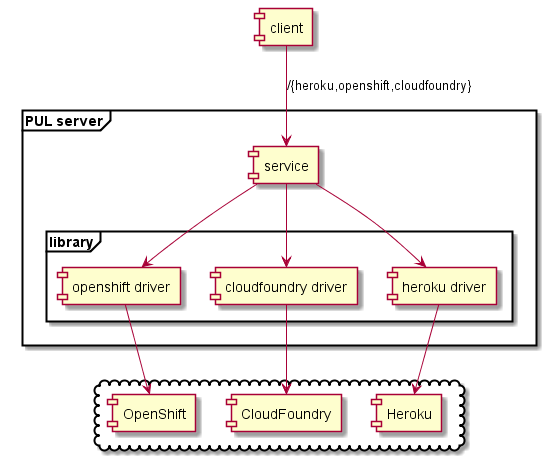
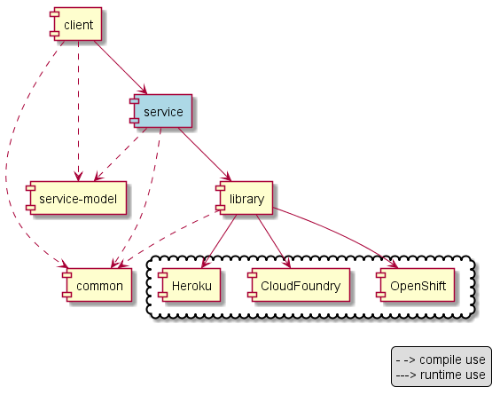

# Developer Guide 

## Architecture

The architecture is composed of the following main blocks:

* library. It is the block in charge of interacting with the remote providers. 
  It contains one driver per type of provider (e.g. one CloudFoundry driver
  will support all of CloudFoundry-type providers). Applications may use the 
  library jar to manage applications.
* service. A uniform REST interface on top of the library
  to manage applications deployed on providers.
* client. A Java client to interact with the service.

There are other jars used by the main blocks:

* service-model. It contains the model classes used on the REST API.
* common. It contains common classes to any other jar.

### Library

A driver must implement two interfaces: 

* PaasClient. It contains an `authenticate` method, accepting credentials to connect to the provider, and 
  returning a PaasSession.
* PaasSession. It contains the operations to manage applications on providers.

The main model classes are:

* Module. It represents an application on library domain.
* PaasSession.DeployParameters. It contains the characteristics of an application: 
  language, env vars, additional properties...

The user must obtain a client and authenticate, then getting a session. With the session, the user can 
perform several management operations. 

Inside the library, applications are called 'modules'. Modules are identified by its name, which usually corresponds
to the name used by the provider.

The library operations receive at least the module name, and usually return an implementation of the Module interface.
All library operations may throw exceptions. The main exceptions to be thrown are:

* PaasException. Encapsulates exceptions raised by provider clients or other expected errors (authentication error,
  create an application with an existing name, delete a non existing application...). A special case of PaasException
  is PaasProviderException, which encloses an unexpected exception thrown by the provider.
* Normal runtime exceptions that indicate a bug. For example, NullPointerException or 
  IllegalArgumentException in case of wrong 
  parameters (they can occur because of a bug in the library implementation or a bug 
  in the library client; in both cases, they are a bug).
* NotImplementedException. This exception should be thrown when a specific functionality is not implemented yet,
  but it is intended to be implemented in the future.

The DeployParameters interface allows one of three sources:

* From path. The path file is an artifact, which will
  be uploaded to the provider. The artifact is either a zipped source code or an object artifact, 
  depending on the provider and application. For example, CloudFoundry accepts source codes for a NodeJS application
  and a WAR for a Java Web Application, while Heroku only accepts source code.
* From GIT URL. The URL points to a public GIT repository, which will be used to clone the code and build. Depending
  on the provider, the cloning is performed at library level or at remote provider level. For example, OpenShift
  accepts the GIT URL (automatically cloning and building), while on Heroku the repository is cloned locally and 
  pushed to Heroku.
* From Docker image name. An image name on a repository accessible by the provider is used to deploy the application.

The drivers support sources in different ways (e.g., not all providers support Docker image names). See the 
section providers to check how each provider is supported.

### Service

TODO

## Adding a new provider

To support a new provider, you can follow the next steps:

* Get familiar with the provider client. Develop tests that are able to login to the provider, deploy applications 
  and get the status of deployed applications using the provider client.
* Implement the ProviderClient and the ProviderAuthenticationIT
* Implement the ProviderSession and the ProviderIT, enriching them in small steps. First, implement createApplication,
  getModule and undeploy and the corresponding test methods. Once they pass, try with the rest of methods.
